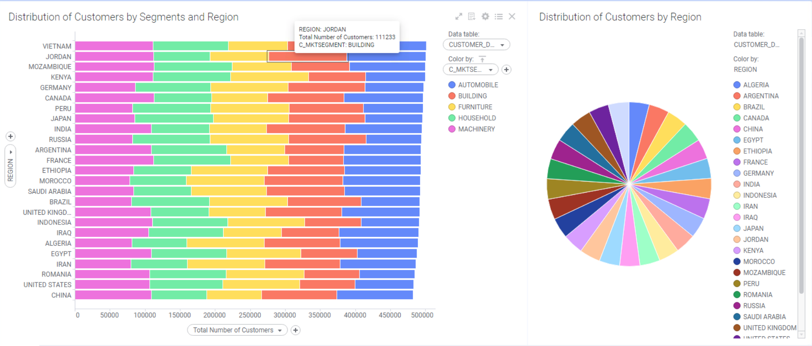
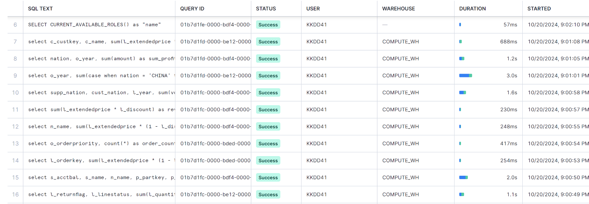

# Snowflake Lab 1

Link to repository: https://github.com/KKDD41/Snowflake_Lab_1.

## Task 1: DB Creation

### Target schemas creation

Were created database `EPAM_LAB` with two schemas inside:
1. `CORE_DWH`: stores unmodified initial 3NF data, and acts as a silver layer. 
It also has internal Snowflake `STAGE` for raw data loading. 
2. `DATA_MART`: stores denormalized data (star-schema) extracted from `CORE_DWH` tables.


### Target tables in CORE_DWH creation
1. 8 Tables in `CORE_DWH` were created with provided DDL file `./ddl/core_dwh_ddl.sql`.
2. Script was unmodified, i.e. no constraints on PK / FK were given.
3. All DDL statements are wrapped as Stored Procedure `create_tables_in_core_dwh`, which will be used in data reloading ETL.


### Star Schema modelling for DATA_MART
Star Schema for `DATA_MART` consists from 3 dimension tables, and one fact composed in the following way:
1. Shared dimension table `NATION_DIM`, formed from `CORE_DWH.NATION` and `CORE_DWH.REGION` tables.
```sql
create table nation_dim
    (
      n_nationkey INTEGER not null,
      n_name      CHAR(27),
      n_comment   VARCHAR(155),
      r_name      CHAR(25),
      r_comment   VARCHAR(152)
    )
```
2. Dimension table `PARTSUPP_DIM`, which united `CORE_DWH.PART`, `CORE_DWH.PARTSUPP`, and `CORE_DWH.SUPPLIER`.
```sql
create table partsupp_dim
    (
      ps_partkey    INTEGER not null,
      p_name        VARCHAR(55),
      p_mfgr        CHAR(25),
      p_brand       CHAR(10),
      p_type        VARCHAR(25),
      p_size        INTEGER,
      p_container   CHAR(10),
      p_retailprice INTEGER,
      p_comment     VARCHAR(23),
      ps_suppkey    INTEGER not null,
      s_name      CHAR(25),
      s_address   VARCHAR(40),
      s_nationkey INTEGER,
      s_phone     CHAR(15),
      s_acctbal   FLOAT8,
      s_comment   VARCHAR(101),
      ps_availqty   INTEGER,
      ps_supplycost FLOAT8 not null,
      ps_comment    VARCHAR(199)
    )
```
3. Dimension table `CUSTOMER_DIM`, corresponding to `CORE_DWH.CUSTOMER`.
```sql
create table customer_dim
    (
      c_custkey    INTEGER not null,
      c_name       VARCHAR(25),
      c_address    VARCHAR(40),
      c_nationkey  INTEGER,
      c_phone      CHAR(15),
      c_acctbal    FLOAT8,
      c_mktsegment CHAR(10),
      c_comment    VARCHAR(117)
    )
```
4. Fact table `LINEITEM_ORDER_FACT`, corresponding to each order of line-item (`CORE_DWH.LINEITEM` and `CORE_DWH.ORDERS`). 
```sql
    create table lineitem_order_fact
    (
      l_orderkey      INTEGER not null,
      o_custkey       INTEGER not null,
      o_orderstatus   CHAR(1),
      o_totalprice    FLOAT8,
      o_orderdate     DATE,
      o_orderpriority CHAR(15),
      o_clerk         CHAR(15),
      o_shippriority  INTEGER,
      o_comment       VARCHAR(79),
      l_partkey       INTEGER not null,
      l_suppkey       INTEGER not null,
      l_linenumber    INTEGER not null,
      l_quantity      INTEGER not null,
      l_extendedprice FLOAT8 not null,
      l_discount      FLOAT8 not null,
      l_tax           FLOAT8 not null,
      l_returnflag    CHAR(1),
      l_linestatus    CHAR(1),
      l_shipdate      DATE,
      l_commitdate    DATE,
      l_receiptdate   DATE,
      l_shipinstruct  CHAR(25),
      l_shipmode      CHAR(10),
      l_comment       VARCHAR(44)
    )
```
### Tables creation in DATA_MART
1. 4 Described tables in `DATA_MART` were created with provided DDL file `./ddl/data_mart_ddl.sql`.
2. In the same way as for `CORE_DWH` schema, no constraints on PK / FK were given.
3. All DDL statements are wrapped as Stored Procedure `create_tables_in_data_mart`, which will be used in data reloading ETL.


## Task 2: Data Loading

### Data Preprocessing
Data was preprocessed locally via Python script `./utils/split_raw_data.py`, including following steps:
1. Splitting large files of `h_lineitem.dsv` and `h_orders.dsv` into several distinct files to fit in Snowflake's 
250MB file limit.
2. Stripping data by removing redundant spaces.
3. Removing unnecessary quotation.
4. Converting files to CSV format with `;` delimiter.
5. Replacing decimal symbol by dot except comma.

Script code:
```python
import pandas as pd
import numpy as np

folder = './tpch_data/tcph2data/'
clean_folder = './tpch_data/tcph_processed_data/'

files_to_split = ['h_lineitem', 'h_order', 'h_customer', 'h_nation', 'h_part', 'h_partsupp', 'h_supplier']
parts_to_split = [8, 2, 1, 1, 1, 1, 1]

for file, parts_num in zip(files_to_split, parts_to_split):
    filepath = folder + file + '.dsv'

    df = pd.read_csv(filepath, sep="|", engine='python', decimal=',')
    df = df.map(lambda x: x.strip() if isinstance(x, str) else x)
    split_dfs = np.array_split(df, parts_num)

    if len(split_dfs) > 1:
        for i, df_i in enumerate(split_dfs):
            df_i.to_csv(clean_folder + file + f'_{i + 1}.csv', index=False, sep=';', decimal='.')
    else:
        split_dfs[0].to_csv(clean_folder + file + f'.csv', index=False, sep=';', decimal='.')
```

### Loading files to Snowflake Stage

Internal Snowflake's `STAGE` creation:


Uploading processed files to `STAGE`:


### Copy data to CORE_DWH tables

Loading from internal Snowflake's `STAGE` to `CORE_DWH` tables was done with help of `COPY INTO` statement. 

In more details process is described in files `./etl/load_from_stage_to_core_dwh_*.sql`, and in section about workflow 
automation.

For this purpose custom `FILE FORMAT` was created to properly handle data according schema defined: 
```sql
CREATE OR REPLACE FILE FORMAT CSV_FORMAT
TYPE = 'CSV'
FIELD_DELIMITER = ';'
field_optionally_enclosed_by='"'
SKIP_HEADER = 1
DATE_FORMAT = 'DD.MM.YY';
```


## Task 3: ETL Data Workflow

### Copy data into DATA_MART tables
Loading from `CORE_DWH` schema to `DATA_MART` tables was done with help of `INSERT INTO .. AS SELECT ...` statement. 


### Workflow Automation
Following approach was implemented for automatic data loading `STAGE -> CORE_DWH -> DATA_MART`:
1. Procedure `reload_data_from_stage_to_core_dwh_procedure` executing `COPY INTO` statements was created (`./etl/load_from_stage_to_core_dwh_procedures.sql`):
```sql
CREATE OR REPLACE PROCEDURE reload_data_from_stage_to_core_dwh_procedure()
RETURNS VARCHAR NOT NULL
LANGUAGE SQL
AS
BEGIN
    CALL create_tables_in_core_dwh('');

    CALL load_data_nation();
    CALL load_data_customer();
    CALL load_data_part();
    CALL load_data_partsupp();
    CALL load_data_region();
    CALL load_data_supplier();
    CALL load_data_lineitem();
    CALL load_data_orders();
    RETURN 'Tables in CORE_DWH were populated with data from STAGE.';
END;
```
2. Procedure `reload_data_from_core_dwh_to_data_mart_procedure` was created, which execute `INSERT INTO` statements 
in proper sequential order (`./etl/load_from_core_dwh_to_data_mart_procedures.sql`):
```sql
CREATE OR REPLACE PROCEDURE reload_data_from_core_dwh_to_data_mart_procedure()
RETURNS VARCHAR NOT NULL
LANGUAGE SQL
AS
BEGIN
    CALL create_tables_in_data_mart('');

    CALL load_nation_dim();
    CALL load_customer_dim();
    CALL load_partsupp_dim();
    CALL load_lineitem_order_fact();

    RETURN 'Tables in DATA_MART were populated with data from CORE_DWH.';
END;
```
3. Cron task was created to reload data from `STAGE` to `CORE_DWH` every 30 minutes:
```sql
CREATE OR REPLACE TASK reload_data_from_stage_to_core_dwh
  WAREHOUSE = COMPUTE_WH
  SCHEDULE = 'USING CRON 0,30 * * * * UTC' -- Runs at the start and 30th minute of every hour
AS
  CALL reload_data_from_stage_to_core_dwh_procedure();
```

4. Created task to reload data from `CORE_DWH` to `DATA_MART` right after previous task execution:
```sql
CREATE OR REPLACE TASK reload_data_from_core_dwh_to_data_mart
  WAREHOUSE = COMPUTE_WH
  AFTER = reload_data_from_stage_to_core_dwh
AS
  CALL reload_data_from_core_dwh_to_data_mart_procedure();
```

5. Enabling tasks execution: 
```sql
ALTER TASK EPAM_LAB.CORE_DWH.reload_data_from_core_dwh_to_data_mart RESUME;
ALTER TASK EPAM_LAB.CORE_DWH.reload_data_from_stage_to_core_dwh RESUME;

SHOW TASKS;
```
<table border="1">
    <thead>
        <tr>
            <th>created_on</th>
            <th>name</th>
            <th>id</th>
            <th>database_name</th>
            <th>schema_name</th>
            <th>owner</th>
            <th>comment</th>
            <th>warehouse</th>
            <th>schedule</th>
            <th>predecessors</th>
            <th>state</th>
            <th>definition</th>
            <th>condition</th>
            <th>allow_overlapping_execution</th>
            <th>error_integration</th>
            <th>last_committed_on</th>
            <th>last_suspended_on</th>
            <th>owner_role_type</th>
            <th>config</th>
            <th>budget</th>
            <th>task_relations</th>
            <th>last_suspended_reason</th>
        </tr>
    </thead>
    <tbody>
        <tr>
            <td>2024-10-19 05:13:14.245 -0700</td>
            <td>RELOAD_DATA_FROM_CORE_DWH_TO_DATA_MART</td>
            <td>01b7cb3d-6f9a-2d2a-0000-000000000036</td>
            <td>EPAM_LAB</td>
            <td>CORE_DWH</td>
            <td>ACCOUNTADMIN</td>
            <td></td>
            <td>COMPUTE_WH</td>
            <td></td>
            <td>["EPAM_LAB.CORE_DWH.RELOAD_DATA_FROM_STAGE_TO_CORE_DWH"]</td>
            <td>started</td>
            <td>CALL reload_data_from_core_dwh_to_data_mart_procedure()</td>
            <td></td>
            <td>null</td>
            <td>null</td>
            <td></td>
            <td></td>
            <td>ROLE</td>
            <td></td>
            <td></td>
            <td>{"Predecessors":["EPAM_LAB.CORE_DWH.RELOAD_DATA_FROM_STAGE_TO_CORE_DWH"]}</td>
            <td></td>
        </tr>
        <tr>
            <td>2024-10-19 04:40:38.293 -0700</td>
            <td>RELOAD_DATA_FROM_STAGE_TO_CORE_DWH</td>
            <td>01b7cb1c-b203-4c6c-0000-000000000031</td>
            <td>EPAM_LAB</td>
            <td>CORE_DWH</td>
            <td>ACCOUNTADMIN</td>
            <td></td>
            <td>COMPUTE_WH</td>
            <td>USING CRON 0,30 * * * * UTC</td>
            <td>[]</td>
            <td>started</td>
            <td>CALL reload_data_from_stage_to_core_dwh_procedure()</td>
            <td></td>
            <td>false</td>
            <td>null</td>
            <td>2024-10-19 05:13:51.488 -0700</td>
            <td>2024-10-19 05:13:42.686 -0700</td>
            <td>ROLE</td>
            <td></td>
            <td></td>
            <td>{"Predecessors":[]}</td>
            <td>USER_SUSPENDED</td>
        </tr>
    </tbody>
</table>
For solution, where Snowpipes were using instead of stored procedures, please refer to **Task 7: Snowpipes**.

## Task 4: Connection to BI-Tool

### Connect Snowflake to DBeaver
Existing Snowflake database `EPAM_LAB` was successfully connected and accessed through DBeaver.


### Connect Snowflake to TIBCO Spotfire
TIBCO Spotfire is a separate and very flexible BI-Tool for dashboards creation. It has its own Snowflake's connector, 
based on Snowflake's ODBC Driver. Steps for connection were preformed:
1. Installation of Snowflake ODBC Driver and DSN Configuring: https://docs.snowflake.com/developer-guide/odbc/odbc-windows.
2. Connecting Snowflake to Spotfire Desktop.


### BI-Report Creation
Full report file is accessible in `./report/Spotfire-Lab-1-Report.dxp`, and full visual export is saved as PDF file
`./report/Snowflake-Lab-1-Report-Export.pdf` for review.




## Task 5: Snowflake SQL

### SnowSQL CLI Tool
For executing queries within command line interface SnowSQL tool was installed and used.


### Benchmark Queries for CORE_DWH
First 10 Benchmark Queries were executed on `CORE_DWH` tables, using `X-SMALL` Compute Warehouse 
(`./benchmarks_queries/tpch_benchmark_queries_core_dwh.sql`):


### Benchmark Queries for DATA_MART
First 10 Benchmark Queries were rewritten to execute on `DATA_MART` tables and were executing using `X-SMALL` Compute Warehouse
(`./benchmarks_queries/tpch_benchmark_queries_data_mart.sql`):


However, as it could be seen from screenshot, cross-table usage is way more complicated for denormalized data, and some of 
the queries require enormous amount of partitions and data to be scanned. 

### Compute Warehouses exploration

For exploratory purposes `LARGE` Compute Warehouse was created:
```sql
create or replace warehouse COMPUTE_WH_LARGE
warehouse_size = LARGE;
```


And as it could be seen from the screenshot below, execution time for `CORE_DWH` benchmark queries was reduced due 
to larger computation capabilities (and higher number of partitions could be stored in cache):


## Task 6: Other Snowflake Features

### Object Cloning
```sql
CREATE OR REPLACE TABLE NATION_DIM_CLONE
CLONE NATION_DIM;
```

### Time Travel
```sql
ALTER TABLE NATION_DIM SET DATA_RETENTION_TIME_IN_DAYS = 3;

-- Accessing NATION_DIM 5 minutes ago
SELECT * FROM my_table AT(OFFSET => -60*5);
```

## Task 7: Snowpipe
Snowpipes were created and used to load data from `STAGE` to `CORE_DWH`. Unfortunately, option `AUTO_INGEST = FALSE`
is not supported by internal Snowflake's stages, therefore following steps were implemented (all details in `./etl/load_from_stage_to_core_pipes.sql`):
1. For each table pipe with `COPY INTO` statement was created
```sql
CREATE OR REPLACE PIPE load_from_stage_h_lineitem
AUTO_INGEST = FALSE AS
    COPY INTO EPAM_LAB.CORE_DWH.LINEITEM
    FROM @EPAM_LAB.CORE_DWH.STAGE
    PATTERN = 'h_lineitem_[0-9].csv'
    FILE_FORMAT = CSV_FORMAT;
    
-- Similarly for other tables
```

2. Stored procedure was created to resume pipes execution.
```sql
CREATE OR REPLACE PROCEDURE reload_data_from_stage_to_core_dwh_procedure(message VARCHAR)
RETURNS VARCHAR NOT NULL
LANGUAGE SQL
AS
BEGIN
    CALL create_tables_in_core_dwh('');

    CALL SYSTEM$PIPE_FORCE_RESUME('EPAM_LAB.CORE_DWH.LOAD_FROM_STAGE_H_CUSTOMER');
    CALL SYSTEM$PIPE_FORCE_RESUME('EPAM_LAB.CORE_DWH.LOAD_FROM_STAGE_H_LINEITEM');
    CALL SYSTEM$PIPE_FORCE_RESUME('EPAM_LAB.CORE_DWH.LOAD_FROM_STAGE_H_NATION');
    CALL SYSTEM$PIPE_FORCE_RESUME('EPAM_LAB.CORE_DWH.LOAD_FROM_STAGE_H_ORDER');
    CALL SYSTEM$PIPE_FORCE_RESUME('EPAM_LAB.CORE_DWH.LOAD_FROM_STAGE_H_PART');
    CALL SYSTEM$PIPE_FORCE_RESUME('EPAM_LAB.CORE_DWH.LOAD_FROM_STAGE_H_PARTSUPP');
    CALL SYSTEM$PIPE_FORCE_RESUME('EPAM_LAB.CORE_DWH.LOAD_FROM_STAGE_H_REGION');
    CALL SYSTEM$PIPE_FORCE_RESUME('EPAM_LAB.CORE_DWH.LOAD_FROM_STAGE_H_SUPPLIER');

    RETURN 'Tables in CORE_DWH were created and populated with data from STAGE.';
END; 
```
3. Task was created for force resuming pipes on demand:
```sql
CREATE OR REPLACE TASK reload_data_from_stage_to_core_dwh
  WAREHOUSE = COMPUTE_WH
AS
  CALL reload_data_from_stage_to_core_dwh_procedure();
```
<table border="1">
    <thead>
        <tr>
            <th>created_on</th>
            <th>name</th>
            <th>database_name</th>
            <th>schema_name</th>
            <th>definition</th>
            <th>owner</th>
            <th>notification_channel</th>
            <th>comment</th>
            <th>integration</th>
            <th>pattern</th>
            <th>error_integration</th>
            <th>owner_role_type</th>
            <th>invalid_reason</th>
            <th>budget</th>
            <th>kind</th>
        </tr>
    </thead>
    <tbody>
        <tr>
            <td>2024-10-19 03:42:47.985 -0700</td>
            <td>LOAD_FROM_STAGE_H_SUPPLIER</td>
            <td>EPAM_LAB</td>
            <td>CORE_DWH</td>
            <td>COPY INTO EPAM_LAB.CORE_DWH.SUPPLIER FROM @EPAM_LAB.CORE_DWH.STAGE PATTERN = 'h_supplier.csv' FILE_FORMAT = CSV_FORMAT</td>
            <td>ACCOUNTADMIN</td>
            <td></td>
            <td></td>
            <td></td>
            <td>h_supplier.csv</td>
            <td></td>
            <td>ROLE</td>
            <td></td>
            <td></td>
            <td>STAGE</td>
        </tr>
        <tr>
            <td>2024-10-19 03:42:19.566 -0700</td>
            <td>LOAD_FROM_STAGE_H_REGION</td>
            <td>EPAM_LAB</td>
            <td>CORE_DWH</td>
            <td>COPY INTO EPAM_LAB.CORE_DWH.REGION FROM @EPAM_LAB.CORE_DWH.STAGE PATTERN = 'h_region.csv' FILE_FORMAT = CSV_FORMAT</td>
            <td>ACCOUNTADMIN</td>
            <td></td>
            <td></td>
            <td></td>
            <td>h_region.csv</td>
            <td></td>
            <td>ROLE</td>
            <td></td>
            <td></td>
            <td>STAGE</td>
        </tr>
        <tr>
            <td>2024-10-19 03:41:56.125 -0700</td>
            <td>LOAD_FROM_STAGE_H_PARTSUPP</td>
            <td>EPAM_LAB</td>
            <td>CORE_DWH</td>
            <td>COPY INTO EPAM_LAB.CORE_DWH.PARTSUPP FROM @EPAM_LAB.CORE_DWH.STAGE PATTERN = 'h_partsupp.csv' FILE_FORMAT = CSV_FORMAT</td>
            <td>ACCOUNTADMIN</td>
            <td></td>
            <td></td>
            <td></td>
            <td>h_partsupp.csv</td>
            <td></td>
            <td>ROLE</td>
            <td></td>
            <td></td>
            <td>STAGE</td>
        </tr>
        <tr>
            <td>2024-10-19 03:46:25.437 -0700</td>
            <td>LOAD_FROM_STAGE_H_PART</td>
            <td>EPAM_LAB</td>
            <td>CORE_DWH</td>
            <td>COPY INTO EPAM_LAB.CORE_DWH.PART FROM @EPAM_LAB.CORE_DWH.STAGE PATTERN = 'h_part.csv' FILE_FORMAT = CSV_FORMAT</td>
            <td>ACCOUNTADMIN</td>
            <td></td>
            <td></td>
            <td></td>
            <td>h_part.csv</td>
            <td></td>
            <td>ROLE</td>
            <td></td>
            <td></td>
            <td>STAGE</td>
        </tr>
        <tr>
            <td>2024-10-19 04:10:15.583 -0700</td>
            <td>LOAD_FROM_STAGE_H_ORDER</td>
            <td>EPAM_LAB</td>
            <td>CORE_DWH</td>
            <td>COPY INTO EPAM_LAB.CORE_DWH.ORDERS FROM @EPAM_LAB.CORE_DWH.STAGE PATTERN = 'h_order_[0-9].csv' FILE_FORMAT = CSV_FORMAT</td>
            <td>ACCOUNTADMIN</td>
            <td></td>
            <td></td>
            <td></td>
            <td>h_order_[0-9].csv</td>
            <td></td>
            <td>ROLE</td>
            <td></td>
            <td></td>
            <td>STAGE</td>
        </tr>
        <tr>
            <td>2024-10-19 03:40:34.572 -0700</td>
            <td>LOAD_FROM_STAGE_H_NATION</td>
            <td>EPAM_LAB</td>
            <td>CORE_DWH</td>
            <td>COPY INTO EPAM_LAB.CORE_DWH.NATION FROM @EPAM_LAB.CORE_DWH.STAGE PATTERN = 'h_nation.csv' FILE_FORMAT = CSV_FORMAT</td>
            <td>ACCOUNTADMIN</td>
            <td></td>
            <td></td>
            <td></td>
            <td>h_nation.csv</td>
            <td></td>
            <td>ROLE</td>
            <td></td>
            <td></td>
            <td>STAGE</td>
        </tr>
        <tr>
            <td>2024-10-19 04:10:21.027 -0700</td>
            <td>LOAD_FROM_STAGE_H_LINEITEM</td>
            <td>EPAM_LAB</td>
            <td>CORE_DWH</td>
            <td>COPY INTO EPAM_LAB.CORE_DWH.LINEITEM FROM @EPAM_LAB.CORE_DWH.STAGE PATTERN = 'h_lineitem_[0-9].csv' FILE_FORMAT = CSV_FORMAT</td>
            <td>ACCOUNTADMIN</td>
            <td></td>
            <td></td>
            <td></td>
            <td>h_lineitem_[0-9].csv</td>
            <td></td>
            <td>ROLE</td>
            <td></td>
            <td></td>
            <td>STAGE</td>
        </tr>
        <tr>
            <td>2024-10-19 03:46:12.648 -0700</td>
            <td>LOAD_FROM_STAGE_H_CUSTOMER</td>
            <td>EPAM_LAB</td>
            <td>CORE_DWH</td>
            <td>COPY INTO EPAM_LAB.CORE_DWH.CUSTOMER FROM @EPAM_LAB.CORE_DWH.STAGE PATTERN = 'h_customer.csv' FILE_FORMAT = CSV_FORMAT</td>
            <td>ACCOUNTADMIN</td>
            <td></td>
            <td></td>
            <td></td>
            <td>h_customer.csv</td>
            <td></td>
            <td>ROLE</td>
            <td></td>
            <td></td>
            <td>STAGE</td>
        </tr>
    </tbody>
</table>

